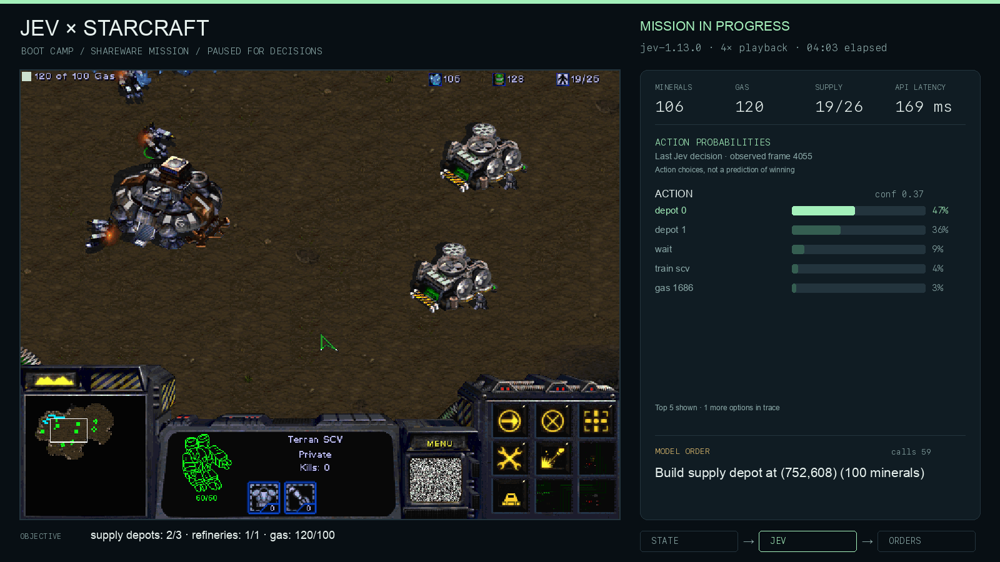

# Jev plays StarCraft shareware

A TypeSafe System One harness for the **original StarCraft shareware Boot Camp
tutorial mission**, with a recording of the game and Jev's actual action
probabilities. Inspired by [TypeSafe's Doom demo](https://typesafe.ai/blog/introducing-system-one-models-and-jev).

[](https://github.com/phyous/tsai-sc/releases/tag/v0.1.0)

**Verified run:** `jev-1.13.0` completed Boot Camp in 4m57s wall time with 81 model
decisions and 170 ms median API latency. The [77-second video](https://github.com/phyous/tsai-sc/releases/download/v0.1.0/jev-starcraft-boot-camp.mp4)
shows the entire run at 4× speed. [Outcome evidence](docs/verified-run.json) records
the original engine's victory result; the release also includes the full decision
log. This is one successful run after harness development, not a win-rate benchmark.

The original 1998 Windows executable runs inside [BottleShip](https://github.com/jenissimo/bottleship).
The harness observes structured game state, asks `jev-latest` to choose a command,
and executes that choice through ordinary mouse and keyboard inputs. The game is
paused during state reads and inference. It is not a screenshot-driven model or
a claim of real-time competitive StarCraft play.

## The mission

Boot Camp requires three completed Supply Depots, one completed Refinery, and
100 gas. One depot already exists at the start. This is the original tutorial,
with no combat required. The harness does **not** implement its own victory
condition: success requires the original executable's committed victory result.
Completing the objectives starts the original closing transmission; the harness
waits for that sequence to finish and for the actual victory result to be committed.

## Run it

Requires Python 3.11+, Git, Node/npm, Chrome with WebGPU, and FFmpeg. Setup installs
Bun locally if it is absent. Tested on macOS Apple Silicon.

```sh
python3 -m venv .venv
source .venv/bin/activate
pip install -e .
scripts/setup-runtime.sh
scripts/start-runtime.sh
```

Leave the runtime terminal open. In a second terminal:

```sh
source .venv/bin/activate
python -m tsai_sc.boot

# Save your own key in a private file outside the repository; chmod 600 it.
# The file contains a single TYPESAFE_API_KEY=... assignment.
python -m tsai_sc.run \
  --env-file "$HOME/.config/tsai-sc/env" \
  --run-dir runs/my-attempt \
  --max-requests 400 --max-seconds 1200

python -m tsai_sc.render runs/my-attempt \
  --output recordings/boot-camp.mp4 --speed 4 --fps 30
python -m tsai_sc.verify runs/my-attempt
```

Alternatively, provide `TYPESAFE_API_KEY` in the environment. Requests go only to
TypeSafe's fixed HTTPS API endpoint. Request limits include retry attempts, and
there is no substitute policy or fabricated response if the API fails.

Setup downloads a pinned BottleShip revision and verifies the demo bundle's
SHA-256. It keeps the runtime, game data, logs, and an isolated browser profile
under ignored `.runtime/`. It does not attach to your personal browser. See
[runtime details](engine/README.md) for setup and the local bridge API.

## How decisions work

```text
Original game memory (read only)
          ↓
Own units + visible resources + economy + mission progress
          ↓
Bounded candidate commands and recent execution feedback
          ↓
TypeSafe Jev: selected command + complete probability distribution
          ↓
Deterministic selection / camera / mouse / hotkey adapter
          ↓
Original StarCraft simulation and mission triggers
```

Jev chooses whether to gather minerals or gas, train an SCV, build a depot or
refinery, or let existing orders continue. The harness supplies known costs,
prerequisites, nearby targets, a small set of tile-aligned construction sites,
and ordinary input sequences. This engineering is part of the experiment:
Jev chooses among actions supplied by the harness, rather than discovering the
game's interface from scratch. Hidden enemies are excluded; owned units remain
observable. Workers inside refineries and unfinished units cannot be selected.

The adapter records dispatch and observed acceptance separately. It never writes
guest memory, grants resources, constructs units directly, or changes mission
triggers. No script overrides a model decision to force a win.

## Recording and evidence

Each attempt contains:

- `manifest.json`: runtime, model, limits, pacing, and initial game state.
- `decisions.jsonl`: actual requests, validated model responses, selected actions,
  normal input events, and observed command results.
- `trace.jsonl` and `frames/`: timestamped game-only frames and the last observed
  decision/state used by the visualizer.
- `result.json`: original engine outcome, final state, counts, and trace hashes.
Interrupted or failed runs instead receive `incomplete.json`.

The video shows **action probabilities**, not estimated chances of winning. It
labels playback speed and decision pauses. Model probabilities are preserved
unchanged. Frames contain only the 640×480 game canvas, with an independently
rendered dashboard. No desktop, login screen, microphone, or API key is recorded.

## Verify

```sh
python -m unittest discover -s tests -v
# Optional live protocol checks, with the runtime running:
TSAI_TEST_BRIDGE_URL=http://127.0.0.1:3917 \
  python -m unittest discover -s tests -p test_bridge_protocol.py -v

# Stage only intended source files, then check the exact staged content:
python scripts/audit_public.py
```

Tests cover malformed model responses, retry/request limits, credential handling,
original-game memory decoding, visibility and win detection, command prerequisites,
placement coordinates, and real FFmpeg output timing/format. Runtime boot and
gameplay also require integration verification against the pinned demo executable.

## Credits and rights

This repository's harness code is MIT licensed. BottleShip is Apache-2.0 with its
own third-party notices. StarCraft and the shareware assets are Blizzard
Entertainment's property and are not included in this repository or relicensed.
See [references](docs/references.md) for the original Doom video and API docs.
